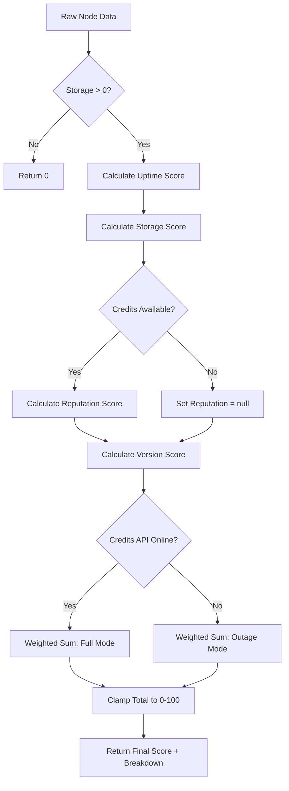

# Xandeum Pulse - Technical Documentation

## Table of Contents

1. [System Overview](#system-overview)
2. [Architecture](#architecture)
3. [Vitality Score Model](#vitality-score-model)
4. [Core Mathematics](#core-mathematics)
5. [Health Score Algorithm](#health-score-algorithm)
6. [Data Pipeline](#data-pipeline)
7. [API Reference](#api-reference)
8. [UI/UX Design Principles](#uiux-design-principles)
9. [Platform Walkthrough](#platform-walkthrough)
10. [Performance & Optimization](#performance--optimization)
11. [Error Handling & Resilience](#error-handling--resilience)

---

## System Overview

Xandeum Pulse is a real-time network monitoring dashboard for the Xandeum blockchain's physical node (pNode) infrastructure. It aggregates data from multiple sources to provide:

- **Real-time node telemetry** (uptime, storage, version)
- **Reputation tracking** (credits earned via the STOINC protocol)
- **Geographic distribution** (IP-based geolocation with ~85% accuracy)
- **Health diagnostics** (multi-factor vitality scoring)

### Key Features

- **Crash-Proof Design**: Handles API failures gracefully with automatic failover
- **Zero External Database**: All state managed client-side or via ephemeral caching
- **Dynamic Thresholds**: Percentile-based tiering adapts to network growth
- **Deep Linking**: Share direct links to specific nodes or map regions

---

## Architecture

### System Diagram

```
┌─────────────────────────────────────────────────────────────┐
│                     XANDEUM PULSE                           │
├─────────────────────────────────────────────────────────────┤
│                                                             │
│  ┌─────────────┐     ┌──────────────┐    ┌──────────────┐ │
│  │   Next.js   │────▶│  API Routes  │◀───│  Xandeum RPC │ │
│  │  Frontend   │     │  (/api/*)    │    │   Network    │ │
│  └─────────────┘     └──────────────┘    └──────────────┘ │
│         │                    │                    │         │
│         │                    │                    │         │
│         ▼                    ▼                    ▼         │
│  ┌─────────────┐     ┌──────────────┐    ┌──────────────┐ │
│  │   React     │     │  Brain Logic │    │   Credits    │ │
│  │ Components  │◀────│ (xandeum-    │◀───│     API      │ │
│  │             │     │  brain.ts)   │    │              │ │
│  └─────────────┘     └──────────────┘    └──────────────┘ │
│         │                    │                              │
│         │                    ▼                              │
│         │            ┌──────────────┐                       │
│         └───────────▶│  Geolocation │                       │
│                      │   Services   │                       │
│                      │ (ip-api.com, │                       │
│                      │  geoip-lite) │                       │
│                      └──────────────┘                       │
│                                                             │
└─────────────────────────────────────────────────────────────┘
```

### Component Breakdown

#### Frontend Layer
- **Next.js 13+**: Server-side rendering for SEO, client-side reactivity for real-time updates
- **Tailwind CSS**: Utility-first styling with custom animations
- **React Simple Maps**: D3-powered geographic visualization
- **Lucide React**: Consistent icon system

#### API Layer (`/pages/api/`)
- **`stats.ts`**: Main telemetry endpoint, returns enriched node data + network statistics
- **`geo.ts`**: Geographic aggregation for map view
- **`credits.ts`**: Proxy for reputation data with timeout handling

#### Brain (`/lib/xandeum-brain.ts`)
- **Data Fetching**: Multi-source failover (primary + 6 backup nodes)
- **Enrichment Pipeline**: Geolocation, health scoring, rank calculation
- **Mathematical Engine**: Implements all scoring algorithms

---

## Vitality Score Model

The **Vitality Score (Health)** represents a node’s overall contribution,
reliability, and protocol alignment within the Xandeum network.

Rather than starting from a perfect score and subtracting penalties,
the system **builds the score upward from zero** using a weighted
multi-factor model.

This design rewards *earned trust* rather than assuming it.

---

### 🚨 Gatekeeper Rule (Hard Constraint)

```
IF storage_committed <= 0
THEN Vitality Score = 0
```

**Rationale:**  
Xandeum is a storage network.  
A node that commits **0 GB** provides zero utility, regardless of uptime,
version, or historical reputation. Such a node is considered *non-participatory*.

This rule is applied **before all other calculations**.

---

### 1️⃣ Uptime Score — Stability & Reliability (Weight: 30%)

**Metric:**  
Node uptime (seconds → days)

**Conceptual Bands:**

- > 30 days → 100 points (Perfect stability)
- 7–30 days → 70–100 points (Trusted)
- 1–7 days → 40–70 points (Proving)
- < 24 hours → 0–40 points (New / volatile)

**Intent:**  
Frequent restarts endanger data availability.  
New nodes must *earn* trust over time.

---

### 2️⃣ Reputation Score — Proven Contribution (Weight: 25%)

**Metric:**  
Node credits compared against **network median credits**

**Relative Performance Scaling:**

- > 2× median → 100 points (Network leader)
- 1×–2× median → 75–100 points
- 0.5×–1× median → 50–75 points
- 0.1×–0.5× median → 25–50 points
- < 10% of median → Scales toward 0

**Intent:**  
Using the **median** keeps the score adaptive.  
As the network matures, expectations rise automatically.

---

### 3️⃣ Capacity Score — Network Utility (Weight: 25%)

**Metric:**  
Committed storage (GB)

**Capacity Tiers:**

- > 1 TB → 100 points (High-capacity hub)
- 100 GB–1 TB → 70–100 points
- 10 GB–100 GB → 40–70 points
- < 10 GB → 0–40 points

**Intent:**  
More committed storage increases redundancy,
resilience, and long-term network health.

---

### 4️⃣ Version Score — Security & Consensus (Weight: 20%)

**Metric:**  
Node version relative to the **network consensus version**
(most common active release)

**Scoring Logic:**

- Same or newer → 100 points
- 1–2 minor versions behind → 80 points
- > 2 minor versions behind → 60 points
- Major version behind → 30 points (Critical risk)

**Intent:**  
Outdated software increases fork risk and security exposure.

---

### 🧮 Weighted Composition

The final Vitality Score is calculated as a **weighted sum** of the four components:

```
Vitality = (Uptime × 0.30)
         + (Reputation × 0.25)
         + (Capacity × 0.25)
         + (Version × 0.20)
```

Scores are clamped to **0–100** after aggregation.

---

### 📊 Example

A node with:

- 15 days uptime
- 500 GB committed storage
- Average network credits
- Latest software version

**Result:**

- Uptime: ~80 × 0.30 = 24
- Reputation: ~60 × 0.25 = 15
- Capacity: ~85 × 0.25 = 21.25
- Version: 100 × 0.20 = 20

**Total:** 80.25 → **80 (Green / Good Health)**

---

## Core Mathematics

### 1. Health Score Calculation

The **Vitality Score** is a weighted composite of four metrics:

```
Total Health = (U × 0.35) + (S × 0.30) + (R × 0.20) + (V × 0.15)
```

Where:
- **U** = Uptime Score (0-100)
- **S** = Storage Score (0-115, bonus-enabled)
- **R** = Reputation Score (0-100, nullable)
- **V** = Version Score (0-100)

#### Dynamic Re-Weighting (Outage Mode)

If the Credits API fails (`R = null`), the system redistributes the 20% weight:

```
Total Health = (U × 0.45) + (S × 0.35) + (V × 0.20)
```

This ensures nodes are still fairly ranked even during upstream failures.

---

### 2. Uptime Score (Sigmoid Function)

Uses a **logistic curve** to heavily penalize young nodes:

```
U = 100 / (1 + e^(-k(t - m)))
```

**Parameters:**
- `t` = uptime in days
- `m` = midpoint (7 days)
- `k` = steepness (0.2)

**Special Rules:**
- If `t < 1 day`: Cap score at 20 (regardless of sigmoid output)
- This prevents brand-new nodes from gaming the system

**Example Values:**
| Uptime | Raw Sigmoid | Final Score |
|--------|-------------|-------------|
| 1 day  | 38.4        | **20** (capped) |
| 7 days | 50.0        | 50 |
| 14 days| 76.2        | 76 |
| 30 days| 98.8        | 98 |

---

### 3. Storage Score (Logarithmic + Bonus)

#### Base Score (Commitment-Only)
```
S_base = min(100, (100/2) × log₂(C/M + 1))
```

Where:
- `C` = node's committed storage (bytes)
- `M` = network median committed storage

**Why Logarithmic?**  
Linear scoring would allow mega-nodes to dominate. Log₂ compression ensures diminishing returns:

| Ratio (C/M) | Score |
|-------------|-------|
| 0.25×       | 25    |
| 1.0× (Median) | 50  |
| 2.0×        | 75    |
| 4.0×        | 100   |

#### Utilization Bonus
```
Bonus = min(15, 5 × log₂(U_GB + 2))
```

Where `U_GB` = storage used (in GB)

**Total Storage Score:**
```
S_total = S_base + Bonus
```

**Can exceed 100** (e.g., 115) to reward active usage. The final Total Health clamps at 100, but the breakdown shows the raw value.

**Example:**
- Node A: 4TB committed, 500GB used
  - Base: 100 (4× median)
  - Bonus: 14.8 (high usage)
  - **Total: 115** ✅

---

### 4. Reputation Score (Linear Percentile)

```
R = min(100, (C / (M_cr × 2)) × 100)
```

Where:
- `C` = node's credits earned
- `M_cr` = network median credits

**Why × 2?**  
Reaching the median = 50 points. Doubles the median = 100 points. This scales gracefully as the network matures.

**Null Handling:**
- If Credits API is offline: `R = null` → triggers re-weighting
- If node has zero credits: `R = 0` (not null)

---

### 5. Version Score (Rank-Based Decay)

Unlike other metrics, version scoring is **ordinal** (based on release order):

```
V = f(distance from consensus)
```

**Scoring Table:**
| Distance | Score | Reasoning |
|----------|-------|-----------|
| Same or newer | 100 | Fully updated |
| -1 version | 90  | Acceptable lag |
| -2 versions | 70 | Warning zone |
| -3 versions | 50 | Outdated |
| -4 versions | 30 | Critical |
| -5 versions | 10 | Ancient |
| -6+ versions | 0-9 | Dead node |

**Implementation:**
```typescript
const consensusIndex = sortedVersions.indexOf(consensusVersion);
const nodeIndex = sortedVersions.indexOf(nodeVersion);
const distance = nodeIndex - consensusIndex;
```

---

### 6. Map Tiering (Percentile-Based)

For **Storage** and **Credits** modes, thresholds are dynamic:

```
T₁ = Q₉₀ (Top 10%)
T₂ = Q₇₅ (Top 25%)
T₃ = Q₅₀ (Top 50%)
T₄ = Q₂₅ (Top 75%)
T₅ = < Q₂₅ (Bottom 25%)
```

**For Health**, thresholds are fixed:
```
T₁ = 90+  (Flawless)
T₂ = 75-90 (Robust)
T₃ = 60-75 (Fair)
T₄ = 40-60 (Shaky)
T₅ = < 40  (Critical)
```

**Color Mapping:**
```typescript
const TIER_COLORS = [
  "#f59e0b", // Tier 1 (Amber)
  "#ec4899", // Tier 2 (Pink)
  "#a855f7", // Tier 3 (Purple)
  "#3b82f6", // Tier 4 (Blue)
  "#22d3ee"  // Tier 5 (Cyan)
];
```

---

## Health Score Algorithm

### Full Calculation Flow



### Edge Cases Handled

1. **Zero Storage Commitment**: Instant disqualification (`total = 0`)
2. **Negative Values**: Clamped to 0 before processing
3. **NaN/Infinity**: Replaced with safe defaults (0 or 1)
4. **Credits Outage**: Automatic re-weighting without manual intervention
5. **Version Parsing Errors**: Defaults to `0.0.0` (worst score)

---

## Data Pipeline

### Fetch Sequence (Every 30 Seconds)

```
1. PRIMARY RPC (173.212.203.145:6000)
   ├─ Timeout: 4 seconds
   └─ Payload: { method: "get-pods-with-stats" }

2. FAILOVER (if primary fails)
   ├─ Shuffle 6 backup nodes
   ├─ Race first 3 responses
   └─ Timeout: 6 seconds each

3. CREDITS API (parallel)
   ├─ URL: https://podcredits.xandeum.network/api/pods-credits
   ├─ Timeout: 4 seconds
   └─ On failure: Set creditsSystemOnline = false

4. GEOLOCATION (batch)
   ├─ Check geoCache (Map<IP, Location>)
   ├─ Missing IPs → ip-api.com (100 IPs/batch)
   └─ Fallback: geoip-lite (local DB)

5. ENRICHMENT (Brain)
   ├─ Merge RPC + Credits data
   ├─ Calculate health scores
   ├─ Assign ranks
   └─ Return enriched nodes + stats
```

### Caching Strategy

**Client-Side:**
- **Favorites**: `localStorage.xandeum_favorites` (persistent)
- **Rank History**: `localStorage.xandeum_rank_history` (trend calculation)
- **Welcome Screen**: `localStorage.xandeum_pulse_welcome_v1` (one-time)

**Server-Side (Ephemeral):**
- **Geo Cache**: In-memory Map, purged on restart
- **No Persistent DB**: All state reconstructed from APIs

---

## API Reference

### `/api/stats`

**Method:** `GET`

**Response Schema:**
```typescript
{
  result: {
    pods: EnrichedNode[]
  },
  stats: {
    consensusVersion: string,
    medianCredits: number,
    medianStorage: number,
    totalNodes: number,
    systemStatus: {
      credits: boolean,
      rpc: boolean
    },
    avgBreakdown: {
      uptime: number,
      version: number,
      reputation: number | null,
      storage: number,
      total: number
    }
  }
}
```

**Error Codes:**
- `503 Service Unavailable`: RPC network unreachable

---

### `/api/geo`

**Method:** `GET`

**Response Schema:**
```typescript
{
  locations: LocationData[],
  stats: {
    totalNodes: number,
    countries: number,
    topRegion: string,
    topRegionMetric: number
  }
}
```

**LocationData Fields:**
- `totalCredits`: **Nullable** if no valid credit data exists for region
- `topPks`: Object mapping `{ STORAGE, CREDITS, HEALTH }` to leader pubkeys

---

### `/api/credits`

**Method:** `GET`

**Timeout:** 8 seconds

**Response:** Raw passthrough from upstream API

**Error Codes:**
- `503`: Upstream API offline or timeout

---

## UI/UX Design Principles

### Visual Hierarchy

1. **Color-Coded Modes**: Each view mode (Storage/Health/Credits) has a dedicated color scheme
   - Storage: Indigo (`#6366f1`)
   - Health: Emerald (`#10b981`)
   - Credits: Orange (`#f97316`)

2. **Progressive Disclosure**: Cards start collapsed, expand on click
   - Overview → Detailed Breakdown → Raw Data
   - Prevents information overload

3. **Micro-Animations**: Every state change has a 300ms transition
   - Fade-ins for new data
   - Slide-ins for drawers
   - Pulse effects for active states

### Accessibility

- **Keyboard Navigation**: All modals closable via `Esc`
- **Touch Targets**: Minimum 44×44px on mobile
- **Contrast Ratios**: WCAG AA compliant (4.5:1 minimum)
- **Screen Readers**: Semantic HTML with ARIA labels

### Responsive Breakpoints

```css
/* Mobile First */
- Base: 375px (iPhone SE)
- sm: 640px (tablets)
- md: 768px (landscape tablets)
- lg: 1024px (laptops)
- xl: 1280px (desktops)
- 2xl: 1536px (wide monitors)
```

---

## Platform Walkthrough

### 1. Dashboard (`/`)

**Primary View:** Grid of node cards with rotating metrics

**Card Cycle (5 Steps, 5-Second Rotation):**
1. Storage Used
2. Storage Committed
3. Health Score
4. Uptime
5. Last Seen

**Smart Jump-to-View:**
- Sorting by Storage → Locks cycle to step 2
- Sorting by Health → Locks cycle to step 3
- Sorting by Uptime → Locks cycle to step 4

**Zen Mode:**
- Minimalist black theme
- Removes all embellishments
- 2-column grid (vs 3-column default)

**Search Tips (Rotating Every 9s):**
- "You can search by node IP, public key, version or country"
- "Use the map to visualize network topology"
- "Copy node url to share a direct link"

---

### 2. Node Inspector Modal

**Triggered By:**
- Clicking any node card
- Deep link: `/?open=<pubkey>`

**Layout:**
```
┌──────────────────────────────────────┐
│  Header: Avatar + Identity + Star   │
├──────────────────────────────────────┤
│  ┌────────┐ ┌────────┐ ┌────────┐  │
│  │ Health │ │Storage │ │Identity│  │ (Collapsed)
│  │  Card  │ │  Card  │ │  Card  │  │
│  └────────┘ └────────┘ └────────┘  │
├──────────────────────────────────────┤
│  Reputation Card │ Physical Location │
├──────────────────────────────────────┤
│  [Compare] [Proof of Pulse]          │
└──────────────────────────────────────┘
```

**Expandable Cards:**
- **Click card** → Expands to 2/3 width panel
- **Shows detailed breakdown** (X-Ray Stats)
- **Click again** → Collapses back

**Versus Mode:**
- Select 2 nodes to compare side-by-side
- Row-by-row stat comparison
- Green checkmarks for better values

**Proof of Pulse:**
- Generates shareable image
- Includes QR code and stats snapshot
- Download as PNG or share to X (Twitter)

---

### 3. Global Map (`/map`)

**Three View Modes:**
1. **Storage**: Pin size = total committed capacity
2. **Health**: Pin shape = diamond (vs square/circle)
3. **Credits**: Pin size = total earnings

**Pin Shapes:**
- **Storage Mode**: Squares
- **Credits Mode**: Circles
- **Health Mode**: Rotated Squares (diamonds)

**Active Pin Effects:**
- Transforms into green star
- Pulsing glow animation
- Floating label with location name

**Split View:**
- Map (top 40vh) + List (bottom 60vh)
- Click pin → Opens split view
- Click region in list → Flies to location

**Regional X-Ray Stats:**
- Avg Density (storage per node)
- Global Share (% of total network)
- Tier Rank (performance percentile)

**Deep Linking:**
- `?focus=<IP>` → Auto-locks to node's location
- If private IP → Shows toast notification

---

### 4. Leaderboard (`/leaderboard`)

**Sorting:** Always by credits (descending)

**Columns:**
1. Rank (with trend arrows)
2. Public Key (truncated)
3. Credits (formatted)

**Expandable Rows:**
- Click row → Shows action buttons
  - **View on Map** (if location available)
  - **View Diagnostics** (opens node inspector)
  - **Calculate** (uses credits in STOINC simulator)

**STOINC Simulator:**
- **Hardware Calculator Mode**: Input nodes, storage, stake → calculates base credits
- **Boost Selector**: Apply NFT/Era multipliers
- **Live Preview**: Shows projected earnings and network share

**Trend Tracking:**
- Compares current rank to previous session
- Stored in `localStorage.xandeum_rank_history`
- Green ↑ arrow = moved up, Red ↓ arrow = dropped

---

## Performance & Optimization

### Bundle Size

**Target:** < 500KB initial load (gzipped)

**Optimization Techniques:**
1. **Tree Shaking**: Only import used components
2. **Code Splitting**: Lazy-load map libraries
3. **Image Optimization**: Use Next.js `<Image>` with WebP
4. **Font Subsetting**: Include only Latin glyphs

### Rendering Strategy

**Static Generation (SSG):**
- Documentation page
- About/FAQ pages

**Server-Side Rendering (SSR):**
- Dashboard (for SEO)
- Leaderboard (for social sharing)

**Client-Side Rendering (CSR):**
- Map (data-heavy, user interaction)
- Modals (ephemeral state)

### Memory Management

**Large Datasets:**
- Node list capped at 100 visible in leaderboard
- Virtualized scrolling for 1000+ nodes (future)
- Map pins limited to 200 simultaneous

**Cleanup:**
```typescript
useEffect(() => {
  const interval = setInterval(fetchData, 30000);
  return () => clearInterval(interval); // ✅ Prevent memory leaks
}, []);
```

---

## Error Handling & Resilience

### Fail-Safe Hierarchy

```
1. Network Unreachable
   └─ Show "Syncing..." state
   └─ Retry with exponential backoff

2. Partial Data Loss (Credits API down)
   └─ Display "API OFFLINE" badges
   └─ Re-weight health scores dynamically
   └─ Continue normal operation

3. Geolocation Failure
   └─ Fallback to geoip-lite (local DB)
   └─ Mark as "Private Network" if still missing

4. Invalid Data (NaN, negative values)
   └─ Replace with safe defaults
   └─ Log to console for debugging

5. Storage Quota Exceeded (localStorage)
   └─ Clear oldest entries (rank history)
   └─ Notify user via toast
```

### User Feedback

**Loading States:**
- Skeleton screens (cards with pulsing gray bars)
- Progress indicators (spinning circles)
- Animated text ("Calculating Fortunes...")

**Error States:**
- Inline alerts (red border + icon)
- Toast notifications (auto-dismiss after 6s)
- Full-screen fallbacks (when entire page fails)

**Success States:**
- Green checkmarks (copy actions)
- Confetti animation (achievements, future)
- Haptic feedback (mobile, future)

---

## Advanced Features

### 1. Smart Card Rotation

Cards cycle through 5 metrics every 5 seconds, but **sorting locks the cycle** to the relevant step:

```typescript
useEffect(() => {
  let targetStep = -1;
  if (sortBy === 'storage') targetStep = 1; // Jump to "Committed"
  else if (sortBy === 'health') targetStep = 2; // Jump to "Health"
  else if (sortBy === 'uptime') targetStep = 3; // Jump to "Uptime"
  
  if (targetStep !== -1) setCycleStep(targetStep);
}, [sortBy]);
```

### 2. Whale Watch (Trend Tracking)

Rank changes are calculated by comparing:
- **Current Rank**: From live API data
- **Previous Rank**: From `localStorage.xandeum_rank_history`

**Storage Schema:**
```json
{
  "xHdG3...": 12,
  "kP9mZ...": 45,
  "qW2nL...": 3
}
```

**Trend Calculation:**
```typescript
const prevRank = history[node.pubkey];
if (prevRank) {
  node.trend = prevRank - currentRank; // Positive = moved up
}
```

### 3. Deep Linking

All major views support URL-based state:

| URL | Effect |
|-----|--------|
| `/?open=<pubkey>` | Opens node inspector |
| `/map?focus=<IP>` | Zooms to location |
| `/leaderboard?highlight=<pubkey>` | Scrolls to row + expands |

**Implementation:**
```typescript
useEffect(() => {
  if (router.isReady && router.query.open && !hasDeepLinked.current) {
    const targetNode = nodes.find(n => n.pubkey === router.query.open);
    if (targetNode) {
      setSelectedNode(targetNode);
      hasDeepLinked.current = true; // Prevent re-trigger
    }
  }
}, [router.isReady, router.query.open, nodes]);
```

---

## Troubleshooting

### Common Issues

**1. "Node not found on map"**
- **Cause**: Node uses VPN/CGNAT (private IP)
- **Solution**: IP geolocation returns (0, 0) → hidden on map
- **Workaround**: View in Dashboard or Leaderboard instead

**2. "Credits show as 0"**
- **Cause**: Node hasn't earned rewards yet, OR Credits API offline
- **Indicator**: Check for "API OFFLINE" badge vs plain "0 Cr"

**3. "Health score dropped suddenly"**
- **Cause**: Credits API went offline → re-weighting shifted balance
- **Solution**: Score will stabilize when API returns

**4. "Map pins overlap"**
- **Cause**: Multiple nodes in same city
- **Solution**: Click any pin → Split view shows full list

**5. "Favorites disappeared"**
- **Cause**: localStorage cleared by browser/extension
- **Prevention**: Export favorites (future feature)

---

## Future Enhancements

### Planned Features

1. **Historical Charts**: 7-day health trends
2. **Alerts**: Email/SMS when node goes offline
3. **Fleet Management**: Bulk view for multi-node operators
4. **API Keys**: Rate-limited access for third-party apps
5. **Mobile App**: Native iOS/Android (React Native)

### Open Research Questions

1. **Optimal Re-Weighting**: Should Uptime get 45% or 40% during outages?
2. **Version Decay Curve**: Linear vs exponential penalty?
3. **Storage Bonus Cap**: 15 points or 20 points?
4. **Map Clustering**: Aggregate overlapping pins?

---

## Contributing

### Code Standards

- **TypeScript Strict Mode**: Enabled
- **ESLint**: `next/core-web-vitals` ruleset
- **Prettier**: 2-space indent, single quotes
- **Commit Messages**: Conventional Commits format

### Testing Protocol

1. **Unit Tests**: (Not yet implemented)
2. **Integration Tests**: Manual QA checklist
3. **Load Testing**: 1000+ concurrent users (future)

### Performance Budgets

| Metric | Target |
|--------|--------|
| First Contentful Paint | < 1.5s |
| Time to Interactive | < 3.0s |
| Lighthouse Score | > 90 |

---

## Credits

**Built by:** riot' ([@33xp_](https://twitter.com/33xp_))  
**Powered by:** Xandeum pRPC Network  
**License:** MIT  
**Repository:** [github.com/Idle0x/xandeum-pulse](https://github.com/Idle0x/xandeum-pulse)

---

*Documentation last updated: December 2024*  
*For questions, open an issue on GitHub or reach out on X.*
